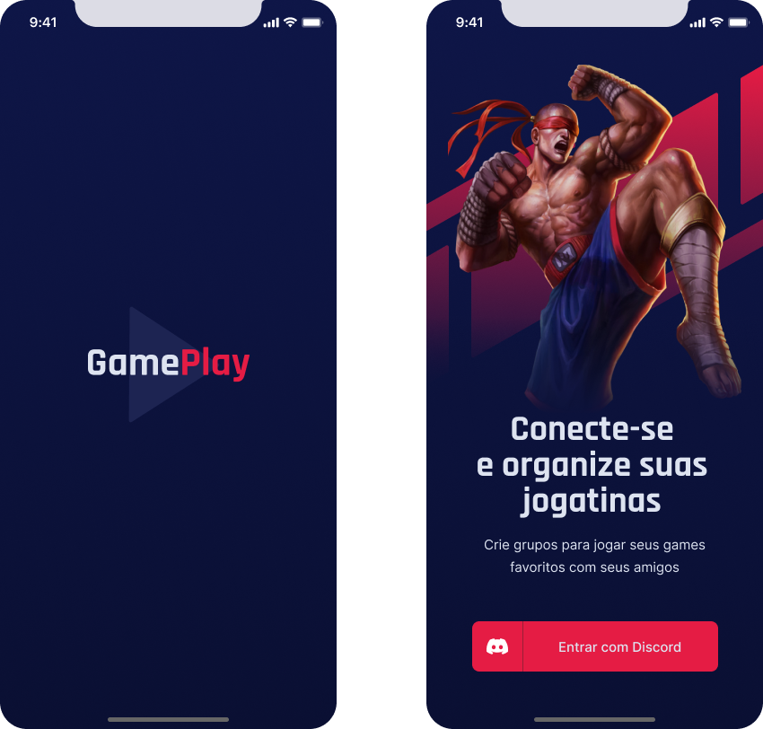
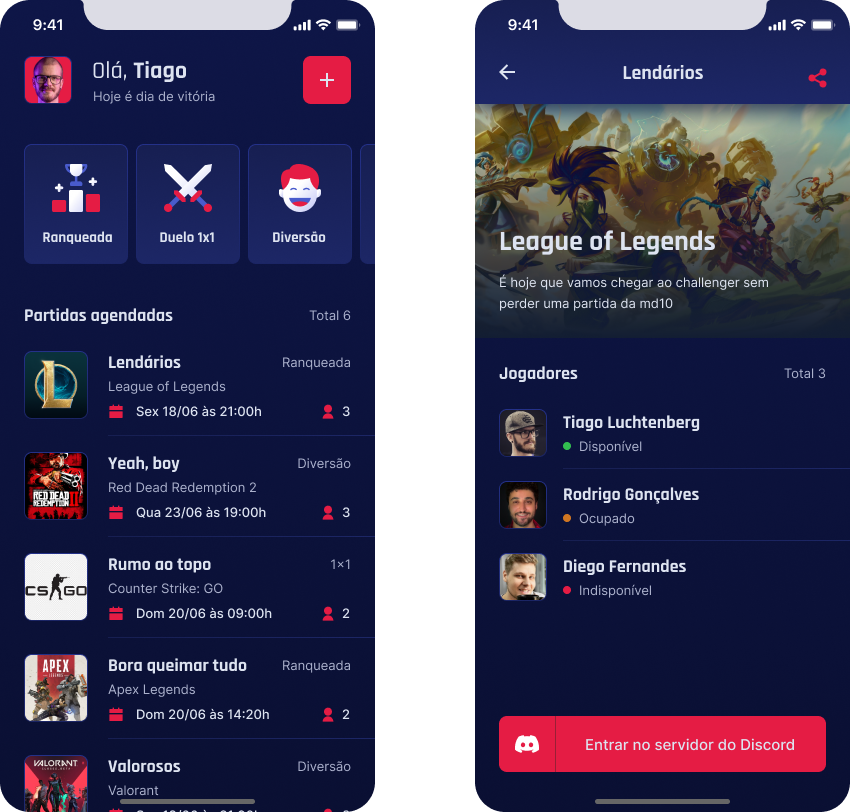

 
 
<h1 align="center">
   
   
   
  Expo | React Native | Discord API | Typescript
</h1>

  
  
    

 
 
 

## :bookmark: Resumo
 

Já ocorreu de você querer jogar juntamente com os seus amigos para se divertir, mas nunca conseguiam agendar um horário fixo?

O GamePlay foi criado justamente para solucionar essa problemática! O GamePlay agenda jogatinas com seus amigos e com a integração da API do 
Discord, o que facilita ainda mais esse processo.

Espero que goste do projeto, o projeto foi construido pela Rocketseat na NLW-Together (um evento que consiste em uma semana de muitos códigos
e desafios para nós devs chegarmos ao próximo nível) e desenvolvido por mim, espero que gostem do projeto!

 

## :bulb: Conteúdos abordados
 

- React Native
- Expo
- Context API's
- React hooks
- Discord API
- Variáveis ambiente

 

## :eyes: Interface do projeto
 

O protótipo do projeto foi construído na plataforma FIGMA e por [@TiagoLuchtenberg](https://www.instagram.com/tiagoluchtenberg/) e ficou lindo! 
seguem algumas das telas logo abaixo:

 

   

 
 

   

 

## :wrench: Colocando o projeto para rodar
 

Para colocar o projeto para rodar, basta seguir o passo a passo fornecido logo abaixo:

Com o Node e o Expo instalados em sua máquina e um emulador ou o Expo Go no dispositivo físico, baixe ou clone este repositório e siga o passo a passo descrito abaixo.

Cadastre o aplicativo no Discord para conseguir acesso ao serviço de autenticação, colocando o redirect como https://auth.expo.io/@<seu usuário no expo>/gameplay e marcando, na aba "OAuth2", as 4 primeiras opções para o escopo, definindo essas configurações também em um arquivo .env no projeto (siga o exemplo do arquivo ".env.example", retirando o '.exemple' depois).

 

## :memo: License

Este projeto esta sob a [MIT license](LICENSE) para mais detalhes.
 
 

## :wave: Social

Siga @Jhonata nas redes :wink:
 

- [LinkedIn](https://www.linkedin.com/in/jhonata-augusto-2301541b5/)
